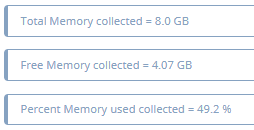

# Ekara-EXPERT_1

<a href="https://api.ekara.ip-label.net/"> 

## Description
This project contains an example of an "Expert" EKARA user journey. This allows you to run a script developed in the language of your choice and executed on a private robot.
The script is developed in [Python](https://www.python.org/) and divided into four steps, each of which aims to retrieve the information below and display it on the [EKARA console](https://ekara.ip-label.net/).
- CPU
- DISK
- Host
- MEMORY

For more information on creating an "Expert" type user journey, you can consult the documentation on the [EKARA Wiki](https://iplabel.atlassian.net/wiki/spaces/WE/overview)

## Screens
Example of restitution: 

Information retrieved:

## Requirements

-|version
--|:--:
Ekara plateform|>=23.12
Private robot|>=1
Python installed on the private robot|x

## Download

[github-download]: https://github.com/MrGuyTwo/Ekara-EXPERT_1/releases
 - [`Ekara-EXPERT_1`][github-download]

## The main function
To create this user journey, you must:
- Start by creating the Python script
- Add the Ekara commands to the Python script for step division, start/stop timing, and error handling
- Create the MANIFEST file
- Add images (if necessary)
- Generate a ZIP file with all these elements

In Ekara, create an "Expert" user journey using the ZIP file 
